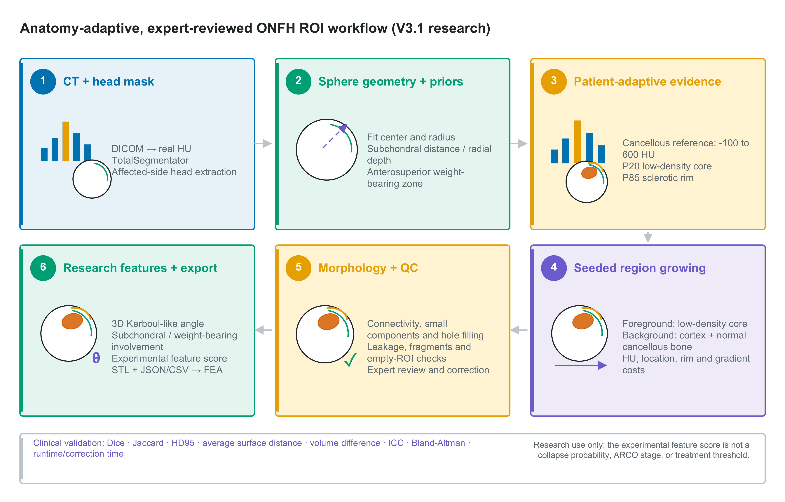

# ONFH Anatomy-Adaptive ROI and FEA Preprocessing

Research software for expert-reviewed region-of-interest (ROI) initialization
and finite element analysis (FEA) preprocessing in osteonecrosis of the femoral
head (ONFH).

> **Research use only.** This repository does not provide autonomous diagnosis,
> clinical staging, or treatment recommendations. Every generated mask requires
> review by a qualified imaging or orthopaedic expert.

## Why This Repository Exists

CT-based ONFH engineering studies depend on more than a threshold. The
femoral-head boundary, lesion-related tissue, postoperative sclerosis, graft
material, and downstream FEA partitions must remain anatomically consistent
and traceable.

This repository provides:

- affected-side femur and femoral-head extraction;
- explainable lesion-related candidate masks;
- anatomy-constrained ROI refinement;
- structured QC warnings;
- named STL export for Mimics/3-matic/ANSYS;
- JSON and CSV provenance reports;
- a documented multi-expert validation protocol.

## Workflow Versions

| Workflow | Purpose | Intensity model | Status |
|---|---|---|---|
| `femoral_necrosis_pipeline_v2.py` | Fixed-threshold manuscript baseline | 10-300 HU core, 600-1800 HU rim | Associated with release `v1.0.0`; expert review required |
| `femoral_necrosis_pipeline_v3.py` | Anatomy-adaptive research workflow | Patient-specific percentiles with absolute HU safety bounds | Development workflow; synthetic tests passed; clinical contour validation pending |
| `femoral_necrosis_pipeline.m` | Mimics MATLAB Link fallback | Fixed Mimics gray-value thresholds | Expert review required |

V2 is retained for traceability. V3 is not presented as a drop-in replacement
for the manuscript-associated release until clinical validation is completed.

## V3 Method

V3 separates the Slicer-independent algorithm from the Slicer integration:

```text
CT DICOM
  -> HU/GV integrity check
  -> TotalSegmentator affected-side femur
  -> physical-axis femoral-head extraction
  -> physical RAS sphere fitting and radial-depth maps
  -> patient-adaptive cancellous reference
  -> low-density and sclerotic-rim features
  -> subchondral and anterosuperior weight-bearing priors
  -> explainable weighted fusion
  -> gradient-aware seeded region growing
  -> spacing-aware morphology and component filtering
  -> automatic QC
  -> expert review
  -> research angular and anatomical-involvement features
  -> STL + JSON + CSV
  -> Mimics/3-matic/ANSYS
```

The fusion score is:

```text
0.45 * low-density score
+ 0.20 * sclerotic-rim proximity
+ 0.20 * subchondral score
+ 0.15 * anterosuperior weight-bearing score
```

The weights are prespecified research parameters, not validated diagnostic
coefficients. See [docs/algorithm_v3.md](docs/algorithm_v3.md) and
[docs/parameter_table.md](docs/parameter_table.md).



## Explainable Outputs

The Slicer v3 workflow creates:

- `FEMORAL_HEAD`
- `LOW_DENSITY_CORE`
- `SCLEROTIC_RIM`
- `SUBCHONDRAL_BAND`
- `WEIGHT_BEARING_ZONE`
- `ANTEROSUPERIOR_ZONE`
- `FOREGROUND_SEED`
- `BACKGROUND_SEED`
- `REGION_GROWN_ROI`
- `NECROSIS_ROI_FINAL`
- `QC_WARNING_REGION`

Per-case file outputs:

```text
<case>_femoral_head_v3.stl
<case>_necrosis_ROI_v3.stl
<case>_onfh_v3_report.json
<case>_onfh_v3_summary.csv
```

The report records software version, configuration, adaptive thresholds,
sphere-fit geometry, physical volumes, component count, 3D Kerboul-like
angular extent, subchondral- and weight-bearing-zone involvement, QC status,
QC codes, and output filenames. V3 deliberately does not assign an ARCO stage.
The experimental 0-100 collapse-feature score is an uncalibrated feature
composite, not a collapse probability or treatment threshold.

## Quick Start: 3D Slicer V3

Requirements:

- 3D Slicer 5.10 or compatible version;
- SlicerTotalSegmentator extension;
- TotalSegmentator model weights;
- NumPy and SciPy available in Slicer Python;
- CT imported as a scalar volume.

Edit the configuration block in
`scripts/slicer/femoral_necrosis_pipeline_v3.py`:

```python
PATIENT_NAME = "anonymized_case_id"
SIDE = "right"
OUTPUT_DIR = r"D:\approved_output_folder"
```

Run with `runpy` in the Slicer Python console:

```python
import runpy

runpy.run_path(
    r"path\to\scripts\slicer\femoral_necrosis_pipeline_v3.py",
    run_name="__main__",
)
```

Keep these files together in the same folder:

```text
femoral_necrosis_pipeline_v2.py
femoral_necrosis_pipeline_v3.py
onfh_v3_core.py
```

Plain `exec(open(...).read())` is not recommended for v3 because it does not
reliably expose the companion-module path.

## Mandatory Expert Review

Review every mask before measurement or FEA. At minimum, confirm:

- the correct side was selected;
- the femoral-head mask does not include acetabulum or excessive neck;
- the final ROI remains inside the head and outside the cortical shell;
- the core and rim agree with CT morphology;
- the ROI agrees with the documented graft or lesion location;
- QC warnings have been resolved or documented;
- surface repair and Boolean partitions are acceptable before meshing.

`PASS` means that no programmed warning threshold was triggered. It does not
mean that the segmentation is clinically correct.

## Validation Status

Automated synthetic tests currently verify:

- adaptive threshold behavior;
- mask containment;
- superior lesion retention;
- inferior low-density decoy rejection;
- small-component removal;
- QC warning generation;
- JSON and CSV report stability.

Clinical spatial accuracy has not yet been established. Before reporting v3 as
an automatic segmentation method, complete the protocol in
[docs/validation_protocol.md](docs/validation_protocol.md), including
multi-expert consensus contours, Dice, Jaccard, HD95, average surface distance,
volume error, correction time, external scanner testing, and FEA uncertainty
propagation. The angular, zone-involvement, and composite features additionally
require outcome calibration and independent external validation before any
prognostic interpretation.

## Run Automated Tests

With a Python environment containing NumPy and SciPy:

```bash
python -m unittest discover -s tests -v
python -m py_compile \
  scripts/slicer/onfh_v3_core.py \
  scripts/slicer/femoral_necrosis_pipeline_v2.py \
  scripts/slicer/femoral_necrosis_pipeline_v3.py
```

The GitHub Actions workflow runs the same checks without executing Slicer-only
APIs.

## Repository Structure

```text
scripts/
  slicer/
    femoral_necrosis_pipeline_v2.py
    femoral_necrosis_pipeline_v3.py
    onfh_v3_core.py
  mimics_matlab_link/
    femoral_necrosis_pipeline.m
tests/
  test_onfh_v3_core.py
docs/
  algorithm_v3.md
  validation_protocol.md
  SOP.md
  parameter_table.md
  fea_preprocessing.md
  code_availability_statement.md
```

## FEA Boundary

Segmentation masks define geometric partitions. Material stiffness remains
assigned from CT HU values unless a different model is explicitly reported.
STL generation does not validate surface repair, mesh convergence, contact
assumptions, or loading conditions. See
[docs/fea_preprocessing.md](docs/fea_preprocessing.md).

## Privacy

Do not commit patient identifiers, raw DICOM, NIfTI volumes, MRML scenes,
screenshots containing identifiers, STL models derived from patients, meshes,
or institution-specific paths. Repository ignore rules cover common generated
and clinical-data formats, but investigators remain responsible for privacy
review.

## Citation and Release Boundary

Release `v1.0.0` is the manuscript-associated fixed-threshold workflow. The v3
branch is a method-development update and should be cited with its eventual
archived release or DOI after validation and versioning.

See [CITATION.cff](CITATION.cff) and
[docs/code_availability_statement.md](docs/code_availability_statement.md).
